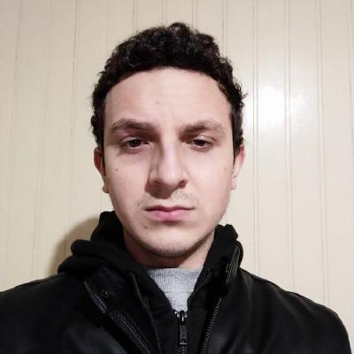
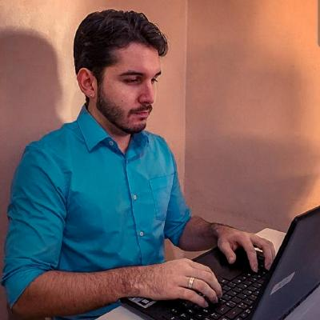
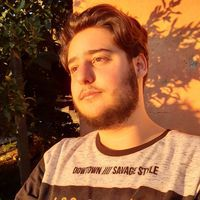

# Lista de Mentorandos

<!--
#### Camilo Cunha de Azevedo

**Idade**: 26 anos ||
**Cidade**: Bento Gonçalves ||
**Link Github**: [Link](https://github.com/Camilotk)

#### O que eu espero para meu futuro:
Eu tenho aprendido muito com as mentorias do Meetanços e tem sido muito bom ver como as pessoas que participam do programa estão se desenvolvendo e vendo seus sonhos acontecer. Para meu futuro eu espero conseguir entrar na Área de Pesquisa Acadêmica em Visão Computacional e IA e conseguir futuramente dar aulas de Programação em Universidades.

---
-->

#### Gustavo Schneider

**Idade**: 22 anos ||
**Cidade**: Bento Gonçalves ||
**Link Github**: [Link](https://github.com/SttavoS)

#### O que eu espero para meu futuro:
Eu espero ser um desenvolvedor/engenheiro de software competente. Mas para isso eu vejo que ainda tenho um longo caminho a trilhar, quero aprender muitas coisas para poder escrever um código de qualidade, me aprofundar em algoritmos, padrões de projeto, testes automatizados, arquitetura de software, etc. Também quero contribuir para o Open Source de alguma forma, e ajudar da outras pessoas da forma que estou sendo ajudado nesta mentoria.

---

#### Matheus Nunes Sena

**Idade**: 23 anos ||
**Cidade**: Cachoeirinha ||
**Link Github**: [Link](https://github.com/msena98)

#### O que eu espero para meu futuro:
Atualmente tenho me empenhado bastante em me tornar futuramente um grande desenvolvedor, desde os princípios básicos até os mais avançados, estou tendo o imenso apoio do projeto de Meentoria do Meetanços. Espero para meu futuro que eu me desenvolva cada vez mais, espero também participar de projetos que impactem a vida das pessoas, fazendo com que a tecnologia traga mais qualidade para vida das pessoas.

---

#### Guilherme Farina Ojeda

**Idade**: 37 anos ||
**Cidade**: Canoas ||
**Link Github**: [Link](https://github.com/bahterista)

#### O que eu espero para meu futuro:
Meu intuito é de atingir um nível de excelência nas habilidades que estamos desenvolvendo no curso. Em dez anos pretendo estar bem colocado no mercado de trabalho de TI, sempre adquirindo e repassando conhecimento, em aperfeiçoamento constante.

---

#### Fernanda Bottega Tomasini

**Idade**: 33 anos ||
**Cidade**: Bento Gonçalves ||
**Link Github**: [Link](https://github.com/FerTomasini)

#### O que eu espero para meu futuro:
Espero no futuro ser uma desenvolvedora de sucesso ou algo próximo! É um longo caminho e muitos desafios a serem vencidos, mas seguimos na luta! Objetivo: ao exterior e além! ✈

---

#### Adriel de Assis

**Idade**: 20 anos ||
**Cidade**: Bento Gonçalves ||
**Link Github**: [Link](https://github.com/JustTroll)

#### O que eu espero para meu futuro:
Espero ser um bom programador e aprender cada dia mais sobre novas coisas.

---

#### Alessandra  Colvara de Souza

**Idade**:29 anos ||
**Cidade**: São Lourenço do Sul ||
**Link Github**:[Link](https://github.com/alepeglow)

#### O que eu espero para meu futuro:

Espero no futuro ser uma boa desenvolvedora front-end de sucesso ou algo próximo! É um longo caminho e muitos desafios a serem vencidos, mas seguimos na luta! Objetivo: ao exterior e além! ✈
